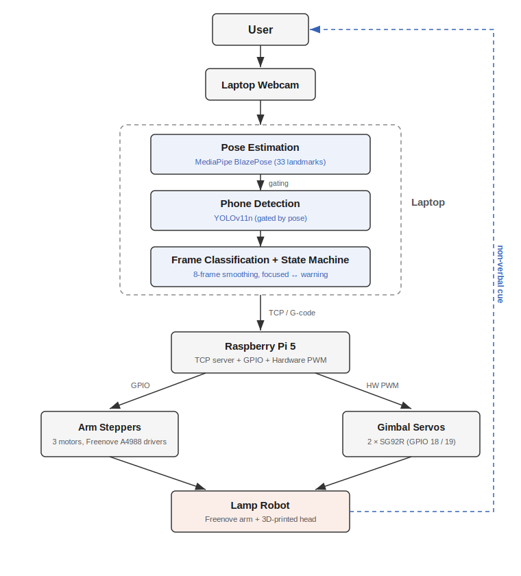
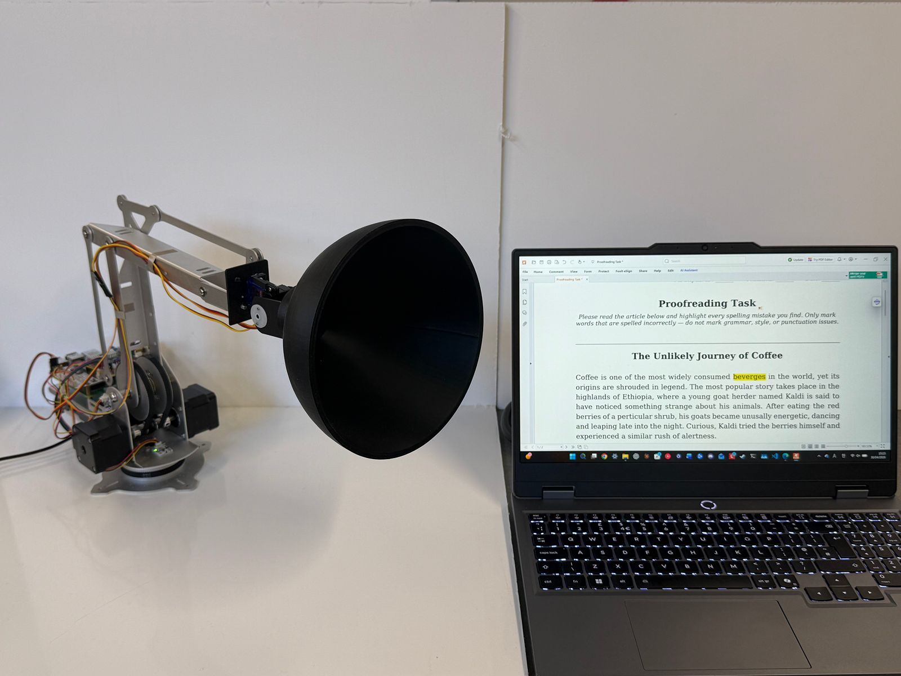

# An Embodied Robotic Companion for Attention Support in ADHD

Source code and analysis for the BSc dissertation by **Luke Kim**, University of Bristol, May 2026.

A desk robot that watches a user through a webcam, detects distraction (phone use or
looking away) using an on-device vision pipeline, and responds with a physical gesture —
a lamp-head "look" from a servo gimbal mounted on a robotic arm — to gently redirect
attention. A within-subjects user study (N = 12) compared the active robot condition
against a passive on-screen-only baseline.


*18-second clip at 3× speed ([full-resolution MP4](docs/images/demo.mp4)). When the vision
pipeline detects distraction, the lamp head turns toward the user as a non-verbal cue.*

## Key result

In a matched 420-second proofreading task, the active robot condition roughly **halved
off-task time** and **tripled the reduction in phone-related distractions** relative to
the passive baseline.

| Measure                | Passive (M ± SD) | Active (M ± SD) | Hedges' *g* |
|------------------------|-----------------:|----------------:|------------:|
| Focused time (%)       |   75.98 ± 12.69  |   91.88 ± 2.78  |   **+1.60** |
| Off-task time (s)      |   86.02 ± 48.93  |  21.62 ± 10.10  |   **−1.68** |
| Phone warnings (n)     |    8.33 ± 6.15   |   2.17 ± 0.75   |   **−1.30** |

Phone warnings differed significantly (Mann–Whitney U, p = .004; p_Holm = .030).
Full tables and figures are in [`analysis/`](analysis/).

## System overview



- **Laptop** captures the webcam feed, runs pose + phone detection, decides when the user
  is distracted, and sends robot commands to the Pi over TCP. See [`src/laptop/`](src/laptop/).
- **Raspberry Pi 5** receives commands, drives the Freenove arm's stepper motors and the
  two gimbal servos. See [`src/raspberry_pi/`](src/raspberry_pi/).

## Repository layout

```
embodied-attention-robot/
├── docs/            Images, architecture diagram, poster
├── hardware/        Bill of materials, wiring, 3D-printed parts
├── src/
│   ├── laptop/      Vision pipeline + TCP client + session logging
│   └── raspberry_pi/  TCP server + GPIO/PWM motor & gimbal control
└── analysis/        Statistical analysis + anonymised, aggregated study data
```

## Quick start (laptop side)

```bash
python -m venv .venv && source .venv/bin/activate   # Windows: .venv\Scripts\activate
pip install -r requirements.txt

# Download the MediaPipe pose model (see src/laptop/ README note) into models/
# YOLOv11n weights (yolo11n.pt) are fetched automatically by Ultralytics on first run.

python src/laptop/integrated_monitor_robot_v3.2.py --participant dev --condition robot_on --no-log
```

Set `ROBOT_IP` in `integrated_monitor_robot_v3.2.py` to your Pi's address. Run without a
Pi using `--no-log` for a vision-only dev session.

## Hardware



- Laptop with webcam
- Raspberry Pi 5 (2 GB), Raspberry Pi OS 64-bit
- Freenove Robot Arm Kit (onboard A4988 stepper drivers)
- Two micro servos (gimbal): rotate on GPIO 18, tilt on GPIO 19
- Custom 3D-printed lamp head

Full bill of materials, wiring, and assembly notes: [`hardware/README.md`](hardware/README.md).

## Third-party components

- **MediaPipe** (Google) — BlazePose pose estimation
- **Ultralytics YOLOv11n** — pre-trained "cell phone" class
- **Freenove Robot Arm Kit** — manufacturer firmware skeleton, adapted
- **2-axis gimbal STL** — https://grabcad.com/library/gimbal-2-axis-with-sg90-mini-servo-3d-printing-1

## Project materials

- [Full dissertation (BSc, PDF)](docs/dissertation.pdf)
- [Research poster (A3, PDF)](docs/poster.pdf)

## Research ethics & data

This study involved human participants. **No raw or identifiable data is included in this
repository** — participant questionnaires, per-frame session logs, and consent records are
excluded. The `analysis/data/` folder contains only de-identified, aggregated outcomes
(pseudonymous participant codes, summary statistics). The study was conducted under
University of Bristol research ethics approval.

## License

Code is released under the [MIT License](LICENSE). Third-party components retain their own
licenses. Study data is shared for academic transparency only.
